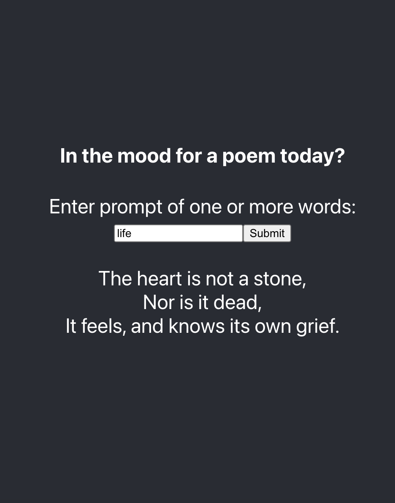
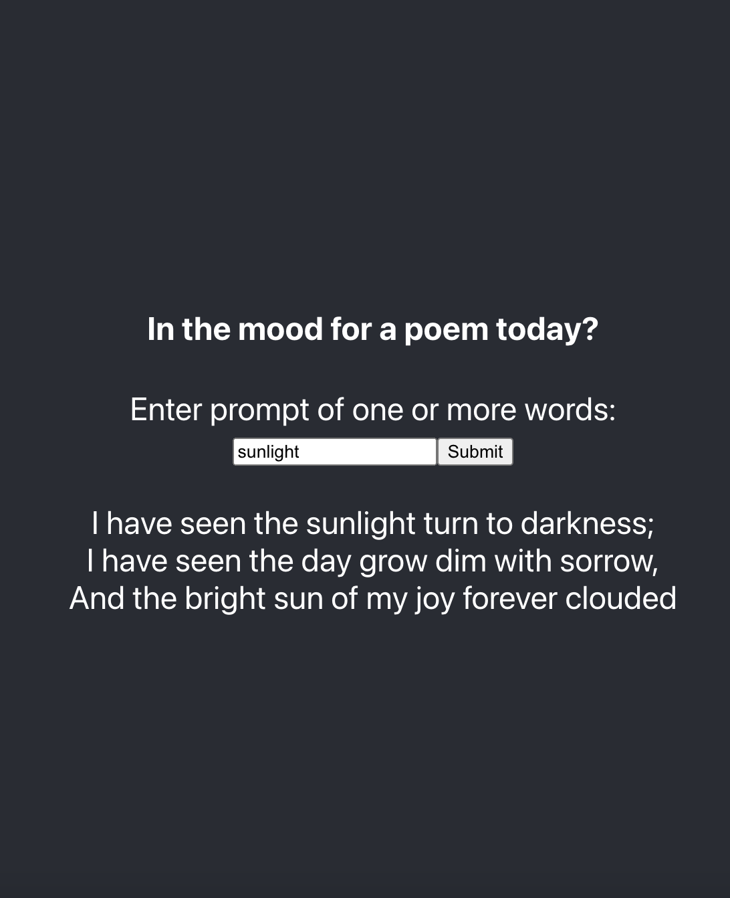
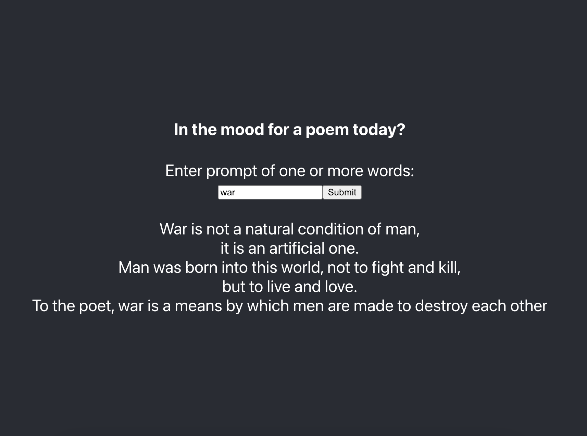
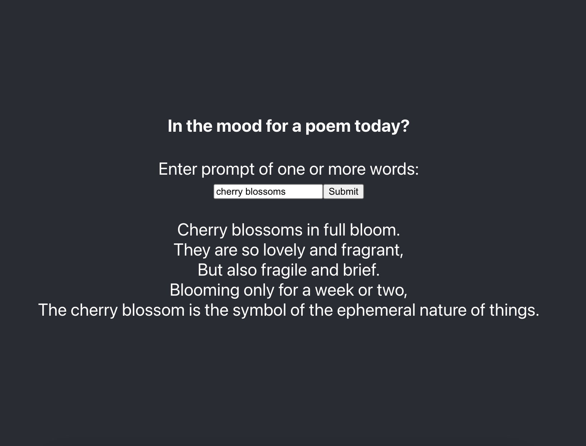

# Getting Started with Create React App

This project was bootstrapped with [Create React App](https://github.com/facebook/create-react-app).

## Running the app

### `yarn start`

Runs the app in the development mode.\
Open [http://localhost:3000](http://localhost:3000) to view it in the browser.

The page will reload if you make edits.\
You will also see any lint errors in the console.

### `yarn build`

Builds the app for production to the `build` folder.\
It correctly bundles React in production mode and optimizes the build for the best performance.

The build is minified and the filenames include the hashes.\
Your app is ready to be deployed!

## OpenAI Parameters

I used the following parameters to make creative poems:

- Max tokens: 60
- Temperature: 0.6
- Frequency penalty: 0.5
- Presence penalty: 0.3
- Stop token: ###

The engine used is the davinci model.

OpenAI API reference: https://beta.openai.com/docs/api-reference/introduction 
Can experiment on Playground: https://beta.openai.com/playground

## Some fun examples

 

 

 

